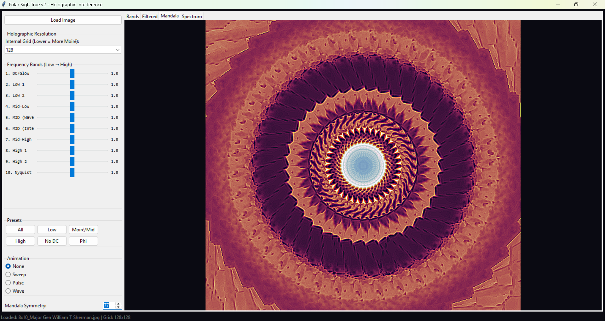
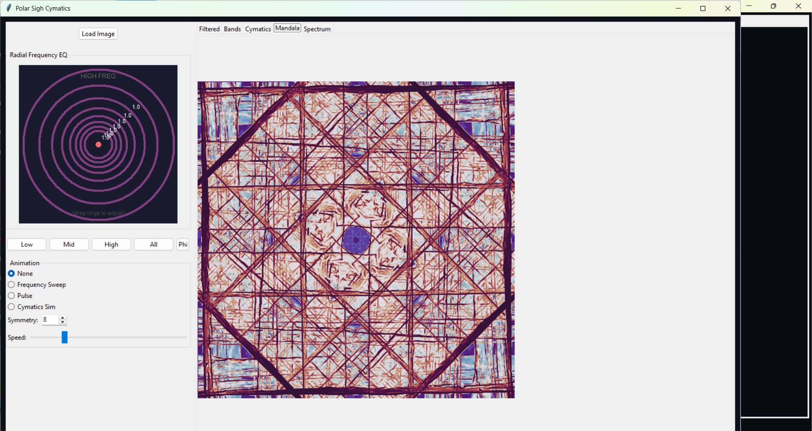

# Polar Sigh & Cymatics Crystallography

A suite of Python applications for exploring the "crystallography of consciousness" through radial frequency decomposition, holographic interference, and cymatic visualization. 

These tools are designed to reveal the hidden standing wave patterns (Moiré) within images, simulating the theoretical "Sigh" of consciousness—a holographic interference field.

## The Applications

### 1. Polar Sigh True (`polar sigh true.py`)

A "Holographic" frequency decomposer that replicates the aesthetic of low-resolution interference.
* **Holographic Resolution:** Process images at lower internal grids (e.g., 64px, 128px) to reveal raw standing wave interference patterns (Moiré) that are usually hidden in high-res data.
* **Mandala Engine:** Spins these interference waves into high-resolution symmetries (up to 999-fold symmetry).
* **Band Isolation:** Isolate specific frequency rings (from DC/Glow to Nyquist) to see which waves construct the image.

### 2. Polar Sigh Cymatics (`frequency_mandalas3.py`)

A visualization tool inspired by physical Chladni plates and cymatics.
* **Radial EQ:** A unique equalizer where the center represents low frequencies and outer rings represent high frequencies. Drag rings to boost/cut specific "vibration modes."
* **Cymatics Simulation:** Simulates wave interference patterns that evolve over time.
* **Mandala Overlay:** Blends the cymatic simulation with the analyzed image.

## Installation

1.  **Install Dependencies:**

    Ensure you have Python installed, then run:

    pip install -r requirements.txt
    
    *Note: The interface uses `tkinter`. This is usually included with Python, but on some Linux distributions (like Ubuntu), you may need to install it separately:*

    sudo apt-get install python3-tk

## Usage

### Running Polar Sigh True

python "polar sigh true.py"

Click Load Image to select a source image.

Adjust Holographic Resolution to change the "interference" quality (Lower = more waves/moiré).

Use the Frequency Bands sliders to isolate specific textures.

Increase Mandala Symmetry to crystallize the patterns.

Running Polar Sigh Cymatics

python frequency_mandalas3.py

Click Load Image.

Drag the colored rings on the Radial EQ to filter the image frequencies spatially.

Select Cymatics Sim under "Animation" to see the standing wave simulation.

For both change the mandala symmetry and look at the mandala tab to look at the mandala patterns. 
They change a lot based on the image you load. 
